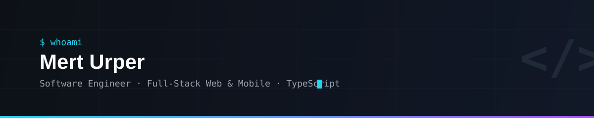
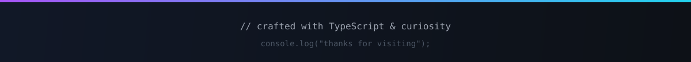

<!-- Header banner (self-hosted, her zaman yüklenir) -->


<p align="center">
  <a href="https://linkedin.com/in/mert-urper">
    
  </a>
  <a href="https://twitter.com/meert_urper">
    
  </a>
  <a href="mailto:your-email@example.com">
    
  </a>
  
</p>

## About

```ts
const mert: SoftwareEngineer = {
  role:      "Full-Stack Web & Mobile Developer",
  location:  "Türkiye 🇹🇷",
  mainLang:  "TypeScript",
  expertise: {
    frontend: ["React", "Next.js", "Tailwind CSS"],
    backend:  ["Node.js", "Express", "NestJS"],
    mobile:   ["React Native", "Expo"],
    data:     ["PostgreSQL", "MongoDB", "Prisma"],
  },
  principle: "Ship end-to-end. Own every layer.",
};
```

- 🔭 Web ve mobil ürünleri fikirden production'a kadar uçtan uca geliştiriyorum
- 🧩 UI, API, veritabanı ve deployment: her katmanda sorumluluk alırım
- 📱 **React Native + Expo** ile cross-platform uygulamalar yayınlıyorum
- 🌱 Sürekli öğrenme modunda, her projede çıtayı yükseltiyorum

## Tech Stack

<table>
  <tr>
    <td><b>Languages</b></td>
    <td>
      
      
      
    </td>
  </tr>
  <tr>
    <td><b>Frontend</b></td>
    <td>
      
      
      
    </td>
  </tr>
  <tr>
    <td><b>Backend</b></td>
    <td>
      
      
      
    </td>
  </tr>
  <tr>
    <td><b>Mobile</b></td>
    <td>
      
      
    </td>
  </tr>
  <tr>
    <td><b>Database</b></td>
    <td>
      
      
      
      
    </td>
  </tr>
  <tr>
    <td><b>DevOps & Tools</b></td>
    <td>
      
      
      
      
      
    </td>
  </tr>
</table>

## Contribution Graph

<!-- profile-3d-contrib.yml workflow'u tarafından üretilir -->
<p align="center">
  
</p>

<!-- Footer (self-hosted) -->

